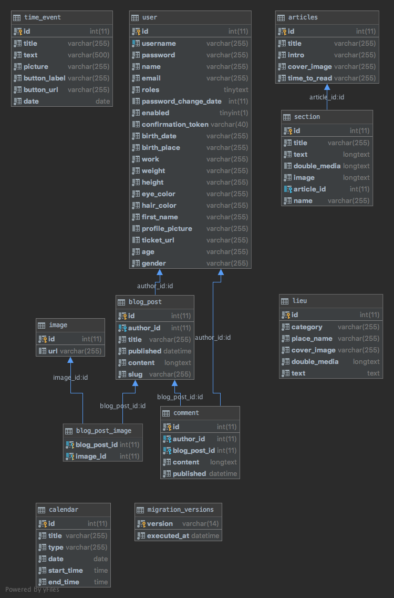

# Exodus-Symfony

## Lien vers le serveur prod

- https://symfony-xmt3.frb.io/

## Installation du projet

Installation des dépendances

`composer install`

Pour run le server 

`php -S 127.0.0.1:8000 -t public/`

Entrer `localhost:8000/api` pour accéder à ApiPlatform.

Entrer `localhost:8000/login` pour accéder au back office. (mêmes identifiants que pour l'application front)

Si une erreur survient pendant la connexion au back office, remplacer `/login` by `/admin`.

Il y a deux endpoint qui ne sont pas disponible via ApiPlatform :
- `localhost:8000/api/weather`
- `localhost:8000/api/picture-day` 

## Choix techniques

J'ai choisi d'utiliser fortrabbit, pour héberger mon application, car c'est une plateforme de mise en ligne simple et qui utilise un serveur apache.

Ensuite, j'ai choisi d'utiliser MySQL en tant que SGBD.

Au niveau des composants, j'ai utilisé doctrine.

Et enfin, les bundles que j'ai utiliser : 

-   EasyAdmin
-   VichUploaderBundle
-   LexikJWTAuthenticationBundle
-   NelmioCors

### MPD 

## Justification des choix techniques

Tout d'abord, j'ai pensé ma partie Back en la découpant le plus possible afin d'avoir des méthodes réutilisable.
Ensuite, j'ai pensé en terme de feature (UploadImage, Authentification, Changement de mot de passe, ApiExterne...)

Ensuite, je suis passé via ApiPlatforme pour gérer mes endpoint plus facilement.
Via les endpoint disponible, j'autorise uniquement des utilisateur connecter pour certaines actions et des utilisateurs `ADMIN` pour la gestion du back-office.

J'ai eu l'occasion d'utiliser plusieurs bundles comme :

-   VichUploaderBundle pour une gestion des images plus simple, afin d'upload des images facilement sur mon serveur.
-   EasyAdmin pour avoir un BackOffice afin d'ajouter du contenu et des utilisateurs.
-   LexikJWTAuthenticationBundle pour la gestion et la génération du token utilisateur.
-   NelmioCors pour gérer les autorisations CORS.

J'ai ensuite utilisé les fixtures afin d'injecter du contenu directement dans mon application.

Le sujet abordé, et la façon dont on l'a approché à grandement influer sur mes choix techniques.

Par exemple dans mon application, j'ai beaucoup de contenu (texte, images et vidéo), et il y a aussi un réseau social. 
Donc l'utilisation d'un token d'authentification est nécessaire, et la mise en place d'un Uploader d'image aussi.
Ensuite, nous avons beaucoup de contenu sur l'application, du coup la mise en place d'un back-office était un gros plus pour rajouter du contenu.
Et dans la continuité de notre projet, on peut ajouter un utilisateur via le back-office (car impossible de créer un compte pour l'utilisateur, c'est une application de privilégié).

